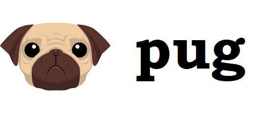

# Platziv

Este proyecto se basa en el proyecto del [Taller Práctico de JavaScript: ¡Crea tu Primer Videojuego!](https://platzi.com/cursos/javascript-practico-videojuegos) de la plataforma de educación online [Platzi](platzi.com).

## Sobre el juego
El juego trata de un programador 👨‍💻 que tiene que llegar a su meta ✅ evitando los diferentes bugs 👾 que puede tener en el camino. El jugador tendrá tres vidas ❤️ pero al encontrarse con un bug perderá una de sus vidas y regresará al inicio del mapa. 
La meta del juego es llegar con éxito a la meta en la menor cantidad de tiempo posible y, en lo posible, romper el record anterior.

	

## Tecnologías utilizadas

	
	
	

**Toda clase de feedback es bienvenido.** 😄

## Trabajemos juntos

	
	
	
	
	

